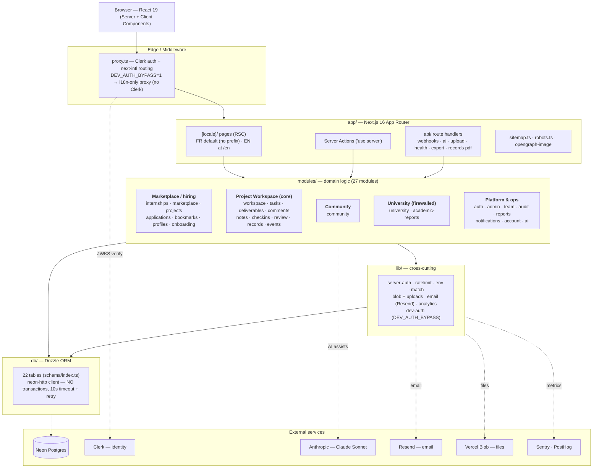
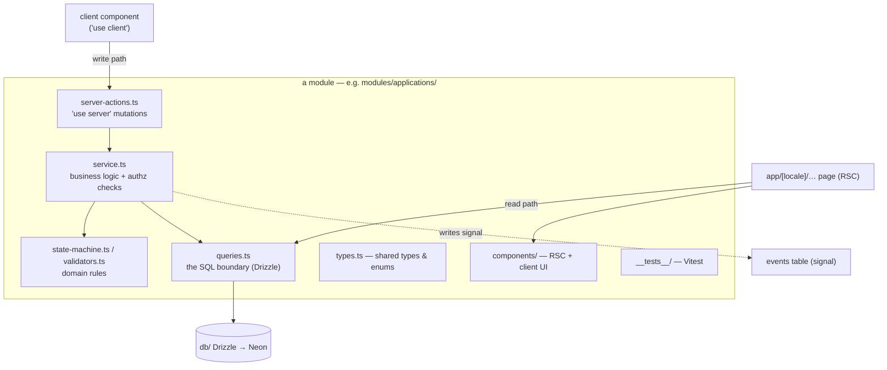
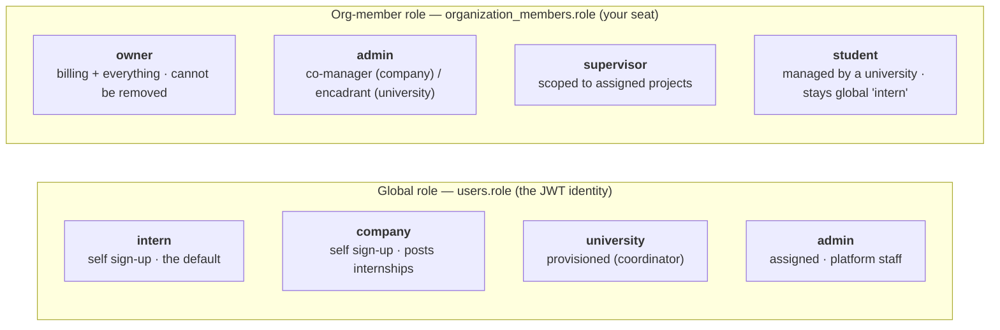
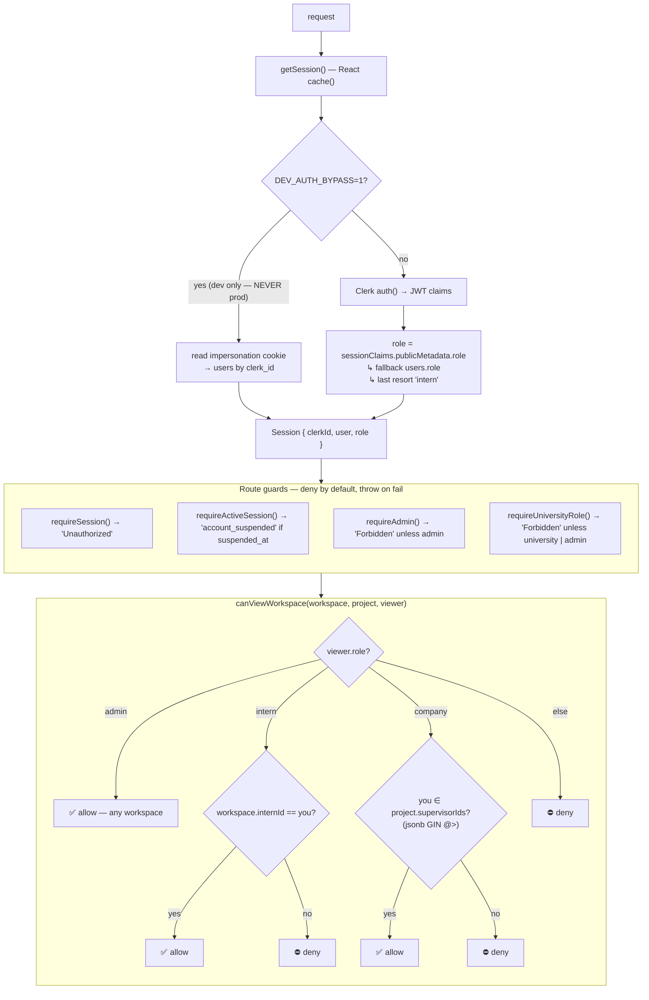
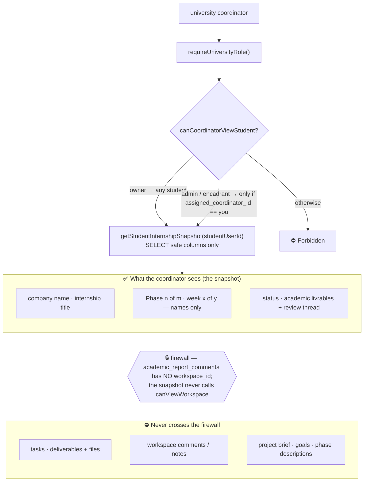
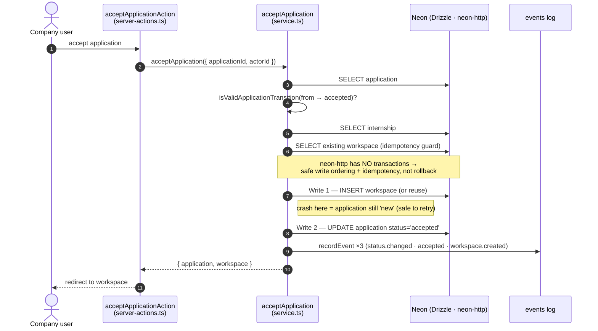
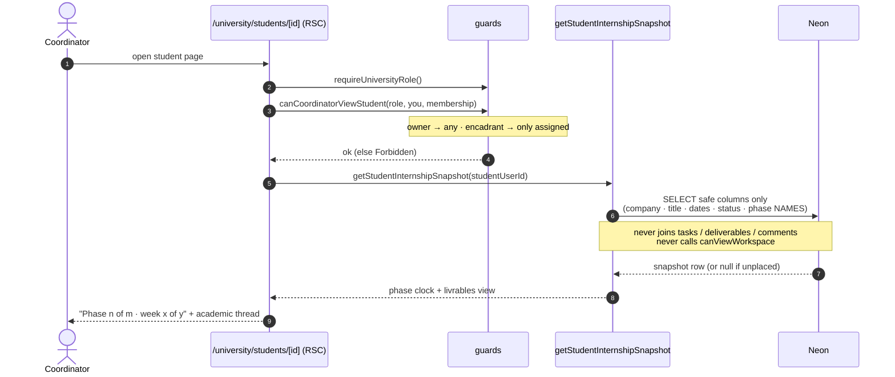
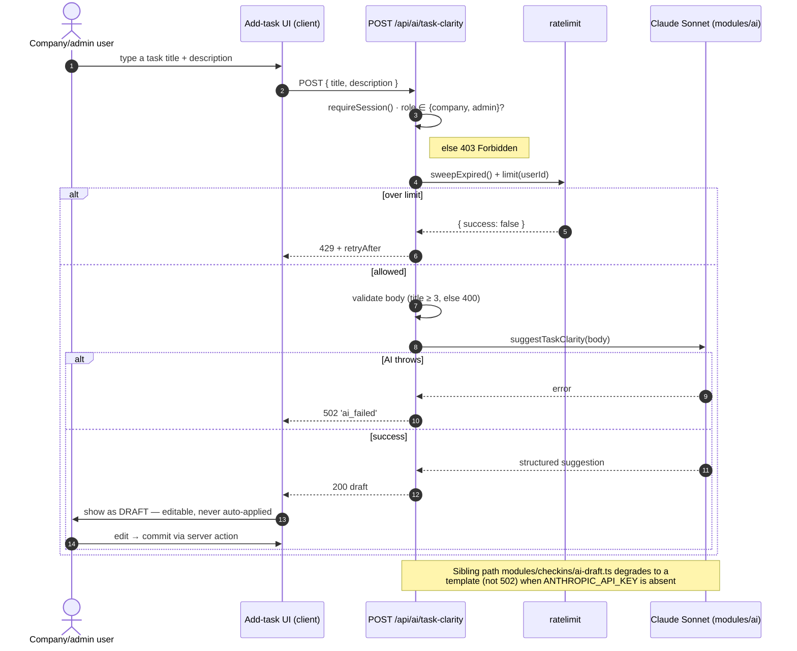

# inturn — Diagrams (data model & architecture)

> **Audience:** developers onboarding to the codebase.
> **Companion to** [`TECHNICAL_OVERVIEW.md`](./TECHNICAL_OVERVIEW.md) — read that for the prose;
> this file is the visual map.
>
> **How to view:** these are [Mermaid](https://mermaid.js.org) diagrams. They render
> natively on **GitHub**, in **VS Code** (with the *Markdown Preview Mermaid* extension),
> and at [mermaid.live](https://mermaid.live). They live in markdown on purpose — version-controlled
> and diffable, no binary image files to drift.
>
> **Generated:** 2026-05-31 against branch `feat/academic-deliverables` (the most-advanced
> branch — superset of production). The **source of truth is always the code** in
> `db/schema/` and `modules/`; regenerate these if the schema moves.
>
> ⚠️ **State note:** this reflects the superset branch. On **production** (`205ca4e`, pre-University)
> the University tables (`academic_reports`, `academic_report_comments`) and the typed-deliverable
> `kind` column **do not yet exist**. See `TECHNICAL_OVERVIEW.md §0` for the three-states model.

**Contents:** [1. Data model (ER)](#1-data-model-er--22-tables) · [2. Architecture](#2-architecture-layered) · [3. Anatomy of a module](#3-anatomy-of-a-module) · [4. Auth & the university firewall](#4-auth--the-university-firewall) · [5. Sequence flows](#5-sequence-flows)

---

## 1. Data model (ER) — 22 tables

This is the closest thing inturn has to a *diagramme de classe*: it's a functional
TypeScript + Drizzle codebase, so the "classes" are the database entities (one Drizzle
table per file in `db/schema/`) plus the relationships between them.

**Read it by domain cluster:**

| Cluster | Tables | The story |
|---|---|---|
| **Identity & org** | `users` · `profiles` · `organizations` · `organization_members` | Who you are, your profile, the org you belong to, and your seat in it. |
| **Marketplace / hiring** | `internships` · `applications` · `internship_bookmarks` · `projects` | A company posts internships (scoped to a project); interns apply and bookmark. |
| **Project Workspace (core)** | `workspaces` · `tasks` · `deliverables` · `comments` · `workspace_notes` · `events` | An accepted application becomes a workspace where the actual work + signal happens. |
| **Records (the credential)** | `internship_records` | Frozen end-of-internship snapshot, publicly shareable by token. |
| **University (firewalled)** | `academic_reports` · `academic_report_comments` | Student livrables + the academic review thread — **structurally isolated** from the company workspace. |
| **Engagement, trust, ops** | `notifications` · `community_posts` · `community_comments` · `reports` · `audit_logs` | The bell, the intern feed, moderation, and the admin audit trail. |

**Three things the diagram encodes that matter:**

1. **The University firewall.** `academic_report_comments` carries **no `workspace_id`** — the
   academic discussion thread cannot be joined to company workspace comments. The firewall is
   enforced in the schema, not just in code.
2. **Polymorphic / FK-less tables.** `events`, plus the `subject`/`target` columns on `reports`
   and `audit_logs`, deliberately have **no foreign keys** (`actor_id`, `target_id`, `subject_id`
   are bare UUIDs). This is intentional: the append-only `events` log is the performance moat and
   must survive the deletion of whatever it references. They appear with dashed/absent links below.
3. **Dual user references.** `internship_records` links users twice (`intern_user_id` *and*
   `generated_by`); `reports` twice (`reporter_id` *and* `resolved_by`); `organization_members`
   up to three times (`user_id`, `invited_by_user_id`, `assigned_coordinator_id`). These are
   collapsed to one labelled edge below to keep the graph readable — see the attribute lists for the detail.

> `comments.task_id` and `comments.deliverable_id` (both nullable) optionally pin a comment to a
> task or deliverable; a comment with both null is a workspace-level comment. These optional edges
> are omitted from the graph for legibility.

```mermaid
erDiagram
    users ||--o| profiles : "has 1:1"
    users ||--o{ organizations : "owns"
    organizations ||--o{ organization_members : "members"
    users |o--o{ organization_members : "seat (null until accept)"
    organizations ||--o{ projects : "owns"
    organizations ||--o{ internships : "posts"
    projects |o--o{ internships : "scopes (optional)"
    internships ||--o{ applications : "receives"
    users ||--o{ applications : "applies"
    internships ||--o{ workspaces : "instantiates"
    users ||--o{ workspaces : "intern"
    organizations ||--o{ workspaces : "hosts"
    workspaces ||--o{ tasks : "has"
    workspaces ||--o{ deliverables : "has"
    tasks |o--o{ deliverables : "may yield"
    workspaces ||--o{ comments : "thread"
    users ||--o{ comments : "authors"
    workspaces ||--o{ workspace_notes : "private notes"
    users ||--o{ workspace_notes : "authors"
    workspaces ||--o{ internship_records : "yields"
    internships ||--o{ internship_records : "for"
    organizations ||--o{ internship_records : "issues"
    users ||--o{ internship_records : "intern / generated_by"
    users ||--o{ academic_reports : "student"
    organizations ||--o{ academic_reports : "university supervises"
    internships |o--o{ academic_reports : "context (optional)"
    academic_reports ||--o{ academic_report_comments : "thread (no workspace)"
    users ||--o{ academic_report_comments : "authors"
    users ||--o{ internship_bookmarks : "saves"
    internships ||--o{ internship_bookmarks : "saved by"
    users ||--o{ notifications : "receives"
    users ||--o{ community_posts : "authors"
    community_posts ||--o{ community_comments : "has"
    users ||--o{ community_comments : "authors"
    users |o--o{ reports : "files / resolves"
    users |o--o{ audit_logs : "actor"

    users {
        uuid id PK
        text clerk_id UK
        text email
        text role "intern|company|admin|university (nullable)"
        timestamp suspended_at "non-null = suspended"
        text locale_pref "fr|en"
    }
    profiles {
        uuid id PK
        uuid user_id FK,UK
        text university
        text field_of_study
        text profile_step "none|basics-done|complete"
    }
    organizations {
        uuid id PK
        uuid owner_id FK
        text slug UK
        text kind "company|university"
        text verification_status "draft|pending|verified|suspended"
        boolean verified
    }
    organization_members {
        uuid id PK
        uuid organization_id FK
        uuid user_id FK "null until invite accepted"
        text email
        text role "owner|admin|supervisor|student"
        text status "invited|active|removed"
        text invite_token "for pending invites"
        uuid assigned_coordinator_id FK "encadrant (->users)"
        uuid invited_by_user_id FK "->users"
    }
    projects {
        uuid id PK
        uuid organization_id FK
        text status "draft|active|archived"
        jsonb supervisor_ids "GIN; drives workspace authz"
        jsonb phases
    }
    internships {
        uuid id PK
        uuid organization_id FK
        uuid project_id FK "nullable"
        text status "draft|published|closed|archived"
        text location_type "on-site|virtual|hybrid"
        tsvector search_vector "FTS (GIN, trigger-maintained)"
    }
    applications {
        uuid id PK
        uuid internship_id FK
        uuid applicant_id FK
        text status "new|reviewed|shortlisted|interview|accepted|rejected"
        text decision_note "company -> candidate"
    }
    internship_bookmarks {
        uuid intern_id PK,FK
        uuid internship_id PK,FK
    }
    workspaces {
        uuid id PK
        uuid internship_id FK
        uuid intern_id FK
        uuid organization_id FK
        text status "active|completed|cancelled"
        date start_date "drives the phase clock"
        date end_date
    }
    tasks {
        uuid id PK
        uuid workspace_id FK
        text status "todo|in-progress|review|done"
        text priority "low|medium|high"
        integer order
    }
    deliverables {
        uuid id PK
        uuid workspace_id FK
        uuid task_id FK "nullable (set null)"
        text status "draft|submitted|approved|revision-requested"
        integer version
        jsonb revision_history
        text share_token "public share"
    }
    comments {
        uuid id PK
        uuid workspace_id FK
        uuid task_id FK "nullable"
        uuid deliverable_id FK "nullable"
        uuid author_id FK
        text body
    }
    workspace_notes {
        uuid id PK
        uuid workspace_id FK
        uuid author_id FK "author-private"
        text body
    }
    internship_records {
        uuid id PK
        uuid workspace_id FK
        uuid internship_id FK
        uuid intern_user_id FK
        uuid organization_id FK
        uuid generated_by FK "restrict"
        text share_token UK "the credential"
        jsonb snapshot "frozen at issuance"
        timestamp revoked_at "soft revoke -> 410"
    }
    academic_reports {
        uuid id PK
        uuid student_user_id FK
        uuid university_org_id FK
        uuid internship_id FK "context only, nullable (set null)"
        text kind "rapport|presentation|diagram|other"
        text status "draft|submitted|approved|revision-requested"
        jsonb revision_history
    }
    academic_report_comments {
        uuid id PK
        uuid report_id FK
        uuid author_id FK
        text body "NO workspace_id (firewall)"
    }
    notifications {
        uuid id PK
        uuid recipient_id FK
        text type
        timestamp read_at "null = unread"
    }
    events {
        uuid id PK
        text type
        uuid actor_id "polymorphic, NO FK"
        uuid target_id "polymorphic, NO FK"
        jsonb metadata
    }
    community_posts {
        uuid id PK
        uuid author_id FK
        text status "active|hidden"
        integer comment_count
    }
    community_comments {
        uuid id PK
        uuid post_id FK
        uuid author_id FK
    }
    reports {
        uuid id PK
        uuid reporter_id FK "set null"
        text subject_type "internship|organization|user"
        uuid subject_id "polymorphic, NO FK"
        text status "open|reviewed|resolved"
        uuid resolved_by FK "set null"
    }
    audit_logs {
        uuid id PK
        uuid actor_id FK "set null"
        text action
        text target_type
        uuid target_id "polymorphic, NO FK"
    }
```

---

## 2. Architecture (layered)

inturn is a **modular monolith**: one Next.js 16 app, organized by domain under `modules/`,
talking to Neon Postgres through Drizzle. There are no microservices. Requests flow top-to-bottom;
the only writes to the database go through a module's `service`/`queries`.

**What the layers enforce (the architecture principles):**

- **Modular monolith** — domain logic lives in `modules/`, never in route files.
- **Data-first / event-sourced** — every consequential action writes an `events` row (the moat,
  and the recovery story since there are *no DB transactions*).
- **Human-in-the-loop AI** — `modules/ai` drafts; a human commits. Every AI call is rate-limited
  (`lib/ratelimit.ts`) and validated against the same zod schema the form uses, and degrades
  gracefully if `ANTHROPIC_API_KEY` is absent.
- **Deny-by-default authz** — access is explicitly granted (e.g. a company user sees a workspace
  only if they're in `project.supervisorIds`), never inferred.

---

## 3. Anatomy of a module

Every domain module follows the same shape, so once you learn one you can read them all.
(Not every module has every file — `workspace` adds `access.ts` + `page-data.ts`,
`applications` adds `state-machine.ts` + `validators.ts` — but the layering always holds.)

**The two paths:**

- **Read path** — a Server Component page calls `queries.ts` directly (a thin SQL boundary) and
  renders. Reads are deny-by-default gated through `service.ts` / `access.ts` guards.
- **Write path** — a client component invokes a `server-actions.ts` action → `service.ts`
  (which checks authz + applies the `state-machine`/`validators` rules) → `queries.ts` → DB,
  and writes an `events` row for the signal log.

---

## 4. Auth & the university firewall

inturn has **two independent role axes**, and most authz confusion comes from conflating them.
Your **global role** (`users.role`, baked into the Clerk JWT) is who you are on the platform; your
**org-member role** (`organization_members.role`) is your seat inside one organization. They're
orthogonal — a managed student keeps the global role `intern` while holding the org seat `student`.

### 4.1 The two role axes

### 4.2 Session resolution, guards & workspace authz

Every request resolves a `Session` once (React `cache()`), then passes through deny-by-default
guards that **throw** on failure. Workspace visibility is the sharpest example: `canViewWorkspace`
grants by role, and a company user only sees a workspace if they're listed in
`project.supervisorIds` (a `jsonb` array matched with a GIN `@>` containment query).

### 4.3 The university firewall

The **university firewall** is the platform's crown jewel. A coordinator supervises a student's
*academic* progress without ever seeing the *company* workspace. The only window is
`getStudentInternshipSnapshot`, which selects a fixed set of safe columns — phase **names** and a
week counter, never the brief, tasks, deliverables, or workspace comments. The query does no auth
itself (the guard already ran) and **never calls `canViewWorkspace`**.

---

## 5. Sequence flows

Three flows that expose the architecture's load-bearing decisions: the transactionless accept,
the firewalled snapshot read, and the human-in-the-loop AI.

### 5.1 Application → workspace (no transactions)

Accepting an application creates the workspace *before* flipping the status, guarded by an
idempotency check — because the neon-http driver **can't do `db.transaction()`**. Safe write
ordering replaces rollback: if the process crashes mid-flight, the application is still `new` and
the operation is safe to retry.

### 5.2 Coordinator reads a student snapshot

The guard decides *whether*; the snapshot query decides *what* — and it never crosses into the
company workspace. (This is §4.3 expressed as a call sequence.)

### 5.3 AI: draft, then a human commits

Every AI endpoint is gated, rate-limited, and validated against the same zod schema the form uses;
the output is always a **draft** the user edits and commits — never auto-applied.

---

## Regenerating these diagrams

These are hand-built from the code, not auto-generated. When the schema or module layout changes:

- **ER diagram:** the entities mirror `db/schema/*.ts`; the relationships mirror the `references(() => …)`
  calls. `grep -rn "references(" db/schema/` lists every foreign key; `grep -rc "pgTable(" db/schema/`
  confirms the table count.
- **Architecture / modules:** the module list is `ls modules/` (minus `__tests__`); the per-module
  files are the `queries.ts` / `service.ts` / `server-actions.ts` / `components/` convention.
- **Auth & firewall:** roles in `modules/auth/types.ts`; session + guards in `modules/auth/session.ts`
  (`getSession`, `requireSession`, `requireActiveSession`, `requireAdmin`, `requireUniversityRole`);
  the firewall in `modules/university/queries.ts` (`getStudentInternshipSnapshot`,
  `canCoordinatorViewStudent`) and `modules/workspace/service.ts` (`canViewWorkspace`).
- **Sequence flows:** accept→workspace in `modules/applications/service.ts` (`acceptApplication`);
  the AI loop in `app/api/ai/*/route.ts`, `modules/ai/*`, and `modules/checkins/ai-draft.ts`.

← Back to [`TECHNICAL_OVERVIEW.md`](./TECHNICAL_OVERVIEW.md) · [`PRODUCT_OVERVIEW.md`](../product/PRODUCT_OVERVIEW.md)
